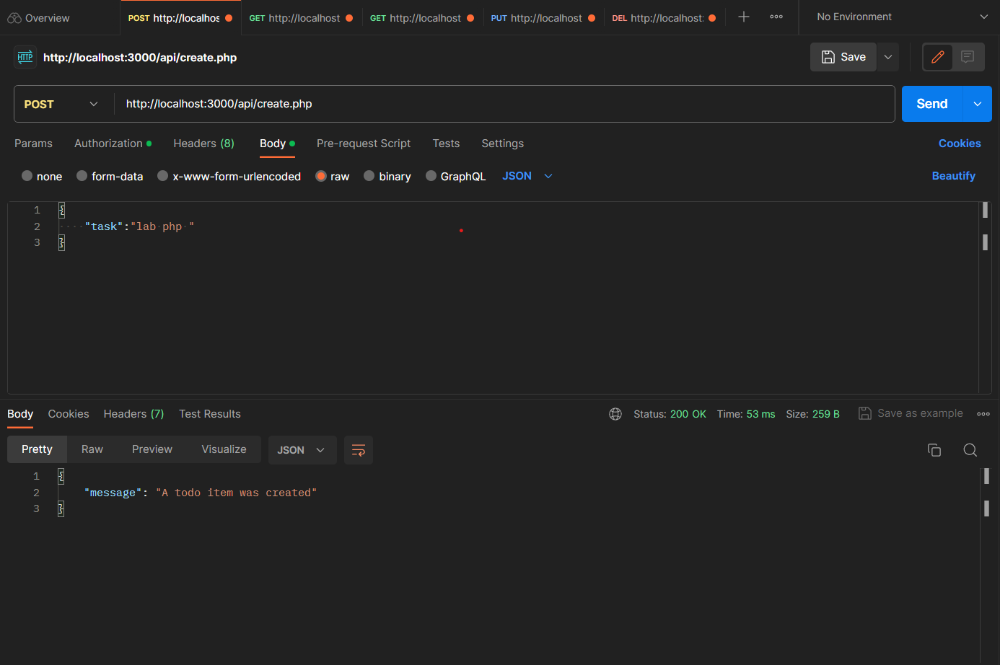
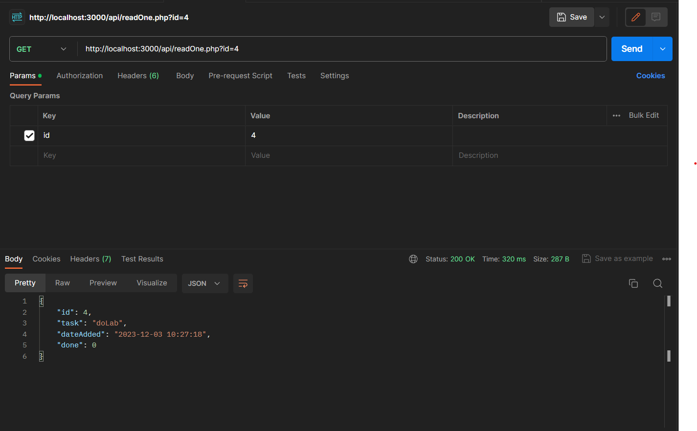
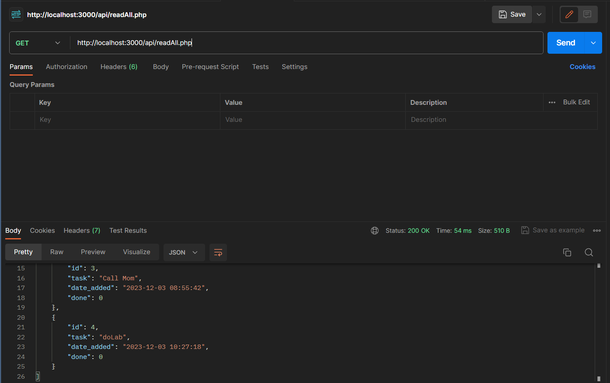
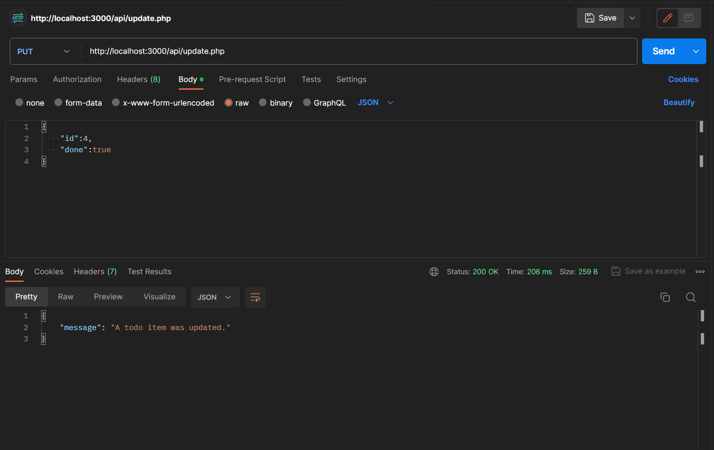
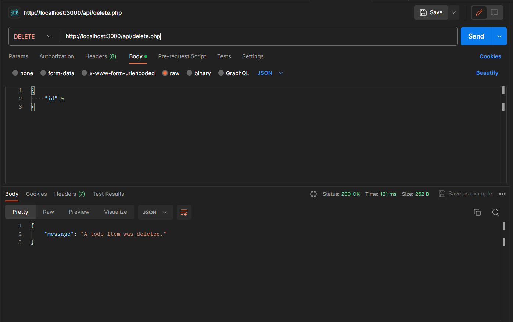

## Rest API Example in PHP
A simple ToDo API in PHP.

## Requirements
- PHP 7+
- MySQL 5.x or MariaDB 10.x database server

## Usage
1. Create a MySQL database, a table, and populate it with data:

    ```sql
    CREATE DATABASE todo_db;
    USE todo_db;
    CREATE TABLE tasks(
        id MEDIUMINT NOT NULL AUTO_INCREMENT, 
        task VARCHAR(255) NOT NULL, 
        date_added DATETIME NOT NULL,
        done BOOLEAN NOT NULL DEFAULT false,
        PRIMARY KEY (id)
        );
    INSERT INTO tasks(task, date_added) VALUES ('Workout', NOW());
    INSERT INTO tasks(task, date_added) VALUES ('Water the plants', NOW());
    INSERT INTO tasks(task, date_added) VALUES ('Call Mom', NOW());
    ```
2. Set the MySQL credentials up by setting environment variables. You should never store sensitive database credentials in your source code. Instead, declare the following environment variables:

    ```shell
    DB_HOST=localhost
    DB_PORT=3306
    DB_DATABASE=todo_db
    DB_USERNAME=root
    DB_PASSWORD=changeme
    ```

    For example to set these environment variables on windows run:
    
    ```powershell
    $env:DB_HOST='localhost'
    $env:DB_PORT=3306
    $env:DB_DATABASE='todo_db'
    $env:DB_USERNAME='root'
    $env:DB_PASSWORD='changeme'
     ```

     while on macOs and Linux run:

     ```shell
    export DB_HOST='localhost'
    export DB_PORT=3306
    export DB_DATABASE='todo_db'
    export DB_USERNAME='root'
    export DB_PASSWORD='changeme'
     ```

    
3. Run the API server:
    ```shell
     php -c C:\php\php.ini-development -S localhost:3000
    ```
4. Send an HTTP request to the API endpoints listed below

### API endpoints

1. `POST /api/create` Create a new ToDo item

    ```shell
    curl --request POST 'http://localhost:3000/api/create.php' \
    --header 'Content-Type: application/json' \
    --data '{
        "task": "Workout"
    }'
    ```

2. `GET /api/readAll.php` Get all Todos

    ```shell
    curl 'http://localhost:3000/api/readAll.php'
    ```

3. `GET /api/readOne.php` Get a single Todo item

    ```shell
    curl 'http://localhost:3000/api/readOne.php?id=1'
    ```

4. `PUT /api/update` Update a ToDo item by its id

    ```shell
    curl --request PUT 'http://localhost:3000/api/update.php' \
    --header 'Content-Type: application/json' \
    --data '{
        "id": 1,
        "done": true
    }'
    ```

5. `DELETE /api/delete` Delete a ToDo item by its id

    ```shell
    curl --request DELETE 'http://localhost:3000/api/delete.php' \
    --header 'Content-Type: application/json' \
    --data '{
        "id": 1
    }'
    ```

### License
MIT






